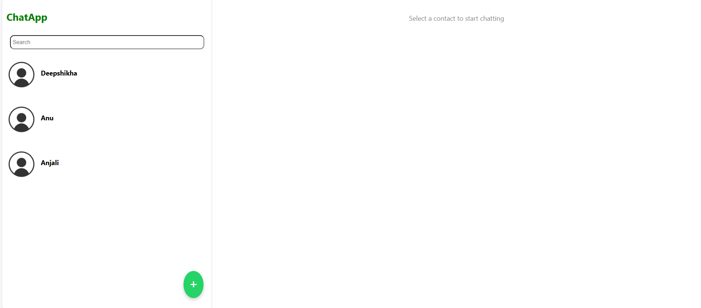

# ChatApp 

This is a chatting web interface built with React.js. It supports message persistence with IndexedDB, offline functionality, and more. The core features of ChatApp are chatting with contacts, add new contacts, displaying messages, and sending new ones.

## Features

- Contact List: Display a list of contacts on the left side.
- Add Contact: Add contact form to add new contact to the contact list.
- Chat Window: Display the chat history of the selected contact on the right side.
- Message Field: Allow users to send new messages.
- Message Storage: Use InstantDB for message storage and retrieval.
- Local Storage: Use IndexedDB to store the data locally for offline capabilities.

## Dashboard
The app displays a list of contacts on the left side of the screen and Chat window on the right side of the screen. Click on a contact to open the chat window.

To add a new contact:

Navigate to the "Add Contact" section by clicking on the plus button in the contactlist section.
Enter a contact name and phone number in the form provided.
Click Add Contact to save the contact.

You can send messages by typing in the input field at the bottom and pressing "Enter" or clicking the send button.

When you select a contact, the messages with that contact appear in the main chat window.

## Tech Stack

- Frontend: React.js
- Backend: No backend for this version (All data is handled locally via IndexedDB).
- Database: IndexedDB (for storing messages and contact information).
- Styling: Custom CSS for the layout and design.

## Deployment
- vercel link: https://chat-app-sigma-lovat.vercel.app